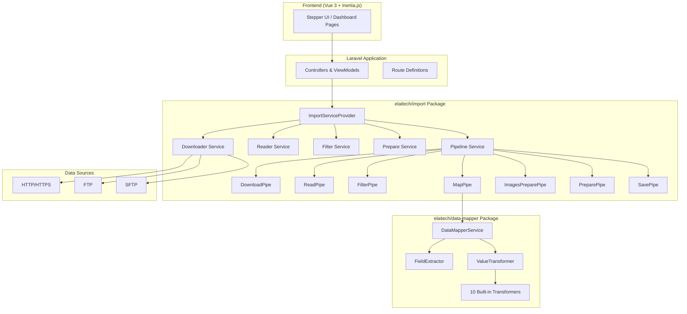

# 🚀 Import Pipeline

A full-stack **data import workflow platform** built with **Laravel 12**, **Vue 3**, and **Inertia.js**. It provides a step-by-step UI for configuring, testing, and executing data import pipelines that can download, read, filter, map, transform, and save data from multiple sources and formats.

> Built by [Elaitech](mailto:info@elaitech.com) • PHP 8.4 • Laravel 12 • Vue 3 • Inertia.js • PostgreSQL 16 • Redis

---

## 📖 Table of Contents

- [Features](#-features)
- [Architecture](#-architecture)
- [Tech Stack](#-tech-stack)
- [Project Structure](#-project-structure)
- [Local Packages](#-local-packages)
- [Pipeline System](#-pipeline-system)
- [Filter System](#-filter-system)
- [Data Mapper](#-data-mapper)
- [Requirements](#-requirements)
- [Installation](#-installation)
- [Development](#-development)
- [Roles & Permissions](#-roles--permissions)
- [API Routes](#-api-routes)
- [Configuration](#-configuration)
- [Testing](#-testing)
- [Docker](#-docker)
- [Notes](#-notes)
- [License](#-license)

---

## ✨ Features

| Category | Details |
|---|---|
| **Pipeline Builder** | Multi-step stepper wizard for creating and editing import pipelines (8 steps) |
| **Download Sources** | HTTP/HTTPS, FTP, SFTP with configurable options per protocol |
| **Data Readers** | CSV, JSON, XML, YAML with format-specific parsing options |
| **Advanced Filtering** | 17 filter operators with AND/OR logic, dot-notation field access, regex support |
| **Data Mapping** | Flexible field-to-field mapping with 10 built-in value transformers |
| **Image Handling** | Configurable image preparation with skip indexes, separators, and download modes |
| **Execution Tracking** | Full execution history with stage-by-stage logs and statistics |
| **Activity Logs** | Audit trail via `spatie/laravel-activitylog` for pipeline and product changes |
| **Role-Based Access** | 4 roles (Super Admin, Admin, Dev, Pipeline Manager) with granular permissions |
| **Pipeline Import/Export** | Import and export pipeline configurations as portable files |
| **Step Testing** | Independently test each pipeline step (downloader, reader, filter, mapper) |
| **Modern UI** | Vue 3 + shadcn-vue components, TanStack Table, Lucide icons, toast notifications |

---

## 🏗 Architecture



---

## 🛠 Tech Stack

### Backend

| Technology | Version | Purpose |
|---|---|---|
| PHP | 8.4+ | Runtime |
| Laravel | 12 | Application framework |
| Inertia.js | 2.0 | Server-driven SPA adapter |
| Spatie Activity Log | 4.11 | Audit logging |
| Spatie Laravel Data | 4.19 | Typed DTOs |
| Spatie Laravel Permission | 6.24 | Roles & permissions |
| Spatie TypeScript Transformer | 2.5 | Auto-generate TypeScript types from PHP |
| Laravel Fortify | 1.34 | Authentication backend |
| Laravel Breeze | 2.3 | Auth scaffolding |
| League Flysystem FTP/SFTP | 3.31 | Remote file access |

### Frontend

| Technology | Version | Purpose |
|---|---|---|
| Vue | 3.5 | UI framework |
| TypeScript | 5.9 | Type-safe JavaScript |
| Vite | 6.0 | Build tool |
| Tailwind CSS | 3.4 | Utility-first CSS |
| TanStack Vue Table | 8.21 | Data tables |
| Reka UI | 2.5 | Headless UI primitives |
| Headless UI | 1.7 | Accessible components |
| Lucide Vue | 0.544 | Icon library |
| VeeValidate + Zod | 4.15 | Form validation |
| Unovis | 1.6 | Data visualization |
| Vue Sonner | 2.0 | Toast notifications |
| Ziggy | 2.6 | Laravel route helpers in JS |

### Infrastructure

| Technology | Version | Purpose |
|---|---|---|
| PostgreSQL | 16+ | Primary database |
| Redis | Latest | Caching (optional) |
| Docker | - | Containerized dev/prod environment |
| Puppeteer | 24.16 | Headless browser (for pipeline fetching) |

---

## 📁 Project Structure

```
import-pipeline/
├── app/
│   ├── Actions/Fortify/          # Auth action handlers (create user, reset password, etc.)
│   ├── Console/                  # Artisan commands
│   ├── Enums/                    # App-level enums (ToastNotificationVariant)
│   ├── Factories/                # Model factories (10 factories)
│   ├── Http/
│   │   ├── Controllers/Dashboard/
│   │   │   ├── Import/           # Pipeline CRUD, Stepper, Test controllers
│   │   │   └── Product/          # Product activity log controllers
│   │   ├── Middleware/
│   │   ├── Responses/            # Fortify login/register responses
│   │   └── ViewModels/           # Inertia view models (20+ view models)
│   ├── Models/                   # User model
│   └── Providers/                # App service providers
│
├── packages/
│   ├── import/                   # elaitech/import — core import engine
│   └── data-mapper/              # elaitech/data-mapper — field mapping & transforms
│
├── resources/ts/
│   ├── Pages/
│   │   ├── Auth/                 # Login page
│   │   └── Dashboard/Import/Pipelines/
│   │       ├── Index.vue         # Pipeline listing with stats
│   │       ├── Show.vue          # Pipeline detail view
│   │       ├── Executions.vue    # Execution history
│   │       ├── ExecutionDetail.vue
│   │       ├── ActivityLogs.vue  # Audit trail
│   │       ├── ActivityLogDetail.vue
│   │       └── Steps/            # 17 step-specific Vue components
│   ├── components/               # 391 reusable Vue components (shadcn-vue based)
│   ├── composables/              # Vue composables (5)
│   ├── constants/                # App constants
│   ├── lib/                      # Utility libraries
│   └── types/                    # Auto-generated TypeScript types
│
├── routes/
│   ├── web.php                   # Entry point
│   ├── import-dashboard.php      # Import pipeline routes (~30 routes)
│   ├── product-dashboard.php     # Product activity log routes
│   └── console.php               # CLI routes
│
├── database/
│   ├── migrations/               # 8 app-level migrations
│   ├── seeders/
│   │   ├── DatabaseSeeder.php
│   │   ├── AdminSeeder.php
│   │   └── RolePermissionSeeder.php
│   └── factories/
│
├── config/                       # 14 config files (including permission, fortify, activitylog)
├── docker/                       # Dockerfile + docker-compose.yml
└── tests/                        # PHPUnit test suite
```

---

## 📦 Local Packages

### `elaitech/import` — Import Engine

The core import logic, extracted as a reusable Laravel package (`packages/import/`).

```
src/
├── Models/
│   ├── ImportPipeline.php            # Main pipeline model
│   ├── ImportPipelineConfig.php      # Pipeline step configurations (JSON)
│   ├── ImportPipelineExecution.php   # Execution run records
│   ├── ImportPipelineLog.php         # Per-stage log entries
│   └── ImportPipelineTemplate.php    # Reusable pipeline templates
│
├── Services/
│   ├── Core/                         # Shared abstracts, contracts, DTOs, exceptions, traits
│   ├── Downloader/                   # HTTP, FTP, SFTP downloaders
│   ├── Reader/                       # CSV, JSON, XML, YAML readers
│   ├── Filter/                       # 17 filter operators + registry + validator
│   ├── Pipeline/                     # Pipeline orchestration, pipes, factories, DTOs
│   ├── Prepare/                      # Data preparation services
│   ├── ImageDownloader/              # Image download handling
│   ├── ImportDashboard/              # Dashboard service + repository
│   ├── Jobs/                         # Queue jobs for pipeline execution
│   ├── Providers/                    # Sub-service providers (5 providers)
│   └── Tests/                        # Package-level test utilities
│
├── Contracts/                        # Repository & service interfaces
├── Enums/                            # 6 enums (status, frequency, stage, step, etc.)
├── Helpers.php                       # Helper functions
└── ImportServiceProvider.php         # Package bootstrap
```

**Database tables** (5 migrations):
- `import_pipelines` — Pipeline definitions
- `import_pipeline_configs` — Step-by-step JSON configuration
- `import_pipeline_executions` — Execution history with status/stats
- `import_pipeline_logs` — Per-stage logging
- `import_pipeline_templates` — Reusable templates

---

### `elaitech/data-mapper` — Data Mapping & Transformation

A standalone mapping library (`packages/data-mapper/`) used by the `MapPipe` stage.

```
src/
├── DataMapperService.php             # Main service — applies mappings to data rows
├── DataMapperServiceProvider.php     # Laravel service provider
├── FieldExtractor.php                # Extracts values from nested/dot-notation paths
├── ValueTransformer.php              # Applies transformation chains to values
├── Contracts/                        # DataMapperInterface, TransformerInterface
├── DTO/                              # MappingConfig, MappingRule, TransformResult
└── Transformers/                     # 10 built-in transformers
    ├── NoneTransformer.php           # Pass-through (no transformation)
    ├── TrimTransformer.php           # Whitespace trimming
    ├── UpperTransformer.php          # Uppercase conversion
    ├── LowerTransformer.php          # Lowercase conversion
    ├── IntegerTransformer.php        # Cast to integer
    ├── FloatTransformer.php          # Cast to float with precision control
    ├── BooleanTransformer.php        # Cast to boolean
    ├── DateTransformer.php           # Date format conversion
    ├── ArrayFirstTransformer.php     # Extract first element from array
    └── ArrayJoinTransformer.php      # Join array elements with separator
```

---

## 🔄 Pipeline System

Each import pipeline passes data through **7 sequential stages** (pipes):

```
┌─────────────┐    ┌──────────┐    ┌────────────┐    ┌──────────┐
│  1. Download │───▶│ 2. Read  │───▶│ 3. Filter  │───▶│  4. Map  │
└─────────────┘    └──────────┘    └────────────┘    └──────────┘
                                                          │
┌─────────────┐    ┌──────────┐    ┌────────────────┐     │
│   7. Save   │◀───│6. Prepare│◀───│5. Images Prep  │◀────┘
└─────────────┘    └──────────┘    └────────────────┘
```

| Stage | Pipe | Description |
|-------|------|-------------|
| 1 | `DownloadPipe` | Fetches data from HTTP, FTP, or SFTP sources |
| 2 | `ReadPipe` | Parses raw data using the configured reader (CSV, JSON, XML, YAML) |
| 3 | `FilterPipe` | Applies filter rules to include/exclude data rows |
| 4 | `MapPipe` | Maps source fields to target fields with value transformations |
| 5 | `ImagesPreparePipe` | Processes image URLs — separators, index skipping, download modes |
| 6 | `PreparePipe` | Final data preparation (category resolution, VIN/stock ID generation) |
| 7 | `SavePipe` | Placeholder — simulates create/update/error statistics |

### Pipeline Configuration Steps (Stepper UI)

The stepper wizard guides users through 8 configuration screens:

1. **Basic Info** — Name, description, frequency
2. **Downloader Config** — Protocol, URL, credentials
3. **Reader Config** — Format, delimiter, encoding, root path
4. **Filter Config** — Filter rules with operators and logic
5. **Mapper Config** — Field mappings with transformers
6. **Images Prepare Config** — Image handling settings
7. **Prepare Config** — Data preparation rules
8. **Preview** — Review full pipeline configuration and test output

---

## 🔍 Filter System

The filter engine supports **17 operators** using the Template Method pattern:

| Operator | Description |
|----------|-------------|
| `equals` / `not_equals` | Exact match (case-sensitive/insensitive) |
| `contains` / `not_contains` | Substring match |
| `starts_with` / `ends_with` | Prefix/suffix match |
| `greater_than` / `less_than` | Numeric comparison |
| `between` / `not_between` | Range check |
| `in` / `not_in` | Set membership |
| `regex` / `not_regex` | Regular expression match |
| `is_null` / `is_not_null` | Null checks |

- **Dot-notation field access** for nested data
- **AND/OR logical grouping** of rules
- **Extensible** — add custom operators by extending `AbstractFilterOperator`

---

## 🗺 Data Mapper

The data mapper transforms source fields to target fields with chained transformers:

| Transformer | Description |
|-------------|-------------|
| `none` | Pass-through |
| `trim` | Remove whitespace |
| `upper` / `lower` | Case conversion |
| `integer` / `float` | Numeric casting |
| `boolean` | Boolean casting |
| `date` | Date format conversion |
| `array_first` | Extract first element |
| `array_join` | Join array with separator |

---

## 📋 Requirements

| Dependency | Version |
|---|---|
| PHP | 8.4+ |
| Composer | 2.x |
| Node.js | 18+ |
| npm | 9+ |
| PostgreSQL | 16+ (or MySQL 8+) |
| Redis | Latest (optional, for caching) |

---

## 🚀 Installation

### Quick Setup (one command)

```bash
composer setup
```

This runs: `composer install` → copy `.env` → generate key → run migrations → `npm install` → `npm run build`.

### Manual Installation

1. **Clone and enter the project:**
   ```bash
   git clone <repository-url>
   cd import-pipeline
   ```

2. **Install PHP dependencies:**
   ```bash
   composer install
   ```

3. **Install Node dependencies:**
   ```bash
   npm install
   ```

4. **Configure environment:**
   ```bash
   cp .env.example .env
   php artisan key:generate
   ```

5. **Set up database** in `.env`:
   ```env
   DB_CONNECTION=pgsql
   DB_HOST=127.0.0.1
   DB_PORT=5432
   DB_DATABASE=import_workflow
   DB_USERNAME=your_username
   DB_PASSWORD=your_password
   ```

6. **Run migrations and seeders:**
   ```bash
   php artisan migrate
   php artisan db:seed
   ```

7. **Generate TypeScript types:**
   ```bash
   php artisan typescript:transform
   ```

8. **Build frontend assets:**
   ```bash
   npm run build
   ```

---

## 💻 Development

### Start the Dev Server

```bash
composer dev
```

This launches **4 concurrent processes** with colour-coded output:

| Process | Colour | Command |
|---|---|---|
| 🔵 Server | Blue | `php artisan serve` |
| 🟣 Queue | Purple | `php artisan queue:listen --tries=1 --timeout=0` |
| 🔴 Logs | Pink | `php artisan pail --timeout=0` |
| 🟠 Vite | Orange | `npm run dev` |

### Useful Commands

```bash
# Run code style fixer
./vendor/bin/pint

# Regenerate TypeScript types from PHP DTOs/ViewModels
php artisan typescript:transform

# Build for production
npm run build

# Watch mode (Vite rebuild on change)
npm run watch
```

---

## 🔐 Roles & Permissions

### Roles

| Role | Description |
|---|---|
| **Super Admin** | Full access to everything |
| **Admin** | All except user management, export, and import |
| **Dev** | Full access (same as Super Admin) |
| **Pipeline Manager** | All except user management |

### Permissions

| Permission | Super Admin | Admin | Dev | Pipeline Manager |
|---|:---:|:---:|:---:|:---:|
| `manage users` | ✅ | ❌ | ✅ | ❌ |
| `manage pipelines` | ✅ | ✅ | ✅ | ✅ |
| `view pipelines` | ✅ | ✅ | ✅ | ✅ |
| `create pipelines` | ✅ | ✅ | ✅ | ✅ |
| `edit pipelines` | ✅ | ✅ | ✅ | ✅ |
| `delete pipelines` | ✅ | ✅ | ✅ | ✅ |
| `export pipelines` | ✅ | ❌ | ✅ | ✅ |
| `import pipelines` | ✅ | ❌ | ✅ | ✅ |

---

## 🌐 API Routes

All routes require authentication and are prefixed with `/dashboard`.

### Import Pipeline Routes (`/dashboard/import`)

| Method | URI | Action |
|---|---|---|
| `GET` | `/pipelines` | List all pipelines |
| `GET` | `/pipelines/{pipeline}` | Show pipeline details |
| `DELETE` | `/pipelines/{pipeline}` | Delete a pipeline |
| `POST` | `/pipelines/import` | Import a pipeline from file |
| `PATCH` | `/pipelines/{pipeline}/toggle-status` | Enable/disable a pipeline |
| `POST` | `/pipelines/{pipeline}/process-now` | Trigger immediate execution |
| `GET` | `/pipelines/{pipeline}/executions` | List executions |
| `GET` | `/pipelines/{pipeline}/executions/{execution}` | Show execution detail |
| `GET` | `/pipelines/{pipeline}/activity-logs` | List activity logs |
| `GET` | `/pipelines/{pipeline}/activity-logs/{activity}` | Show activity log detail |
| `GET` | `/pipelines/{pipeline}/export` | Export pipeline config |

### Stepper Routes

| Method | URI | Action |
|---|---|---|
| `GET` | `/pipelines/stepper/create` | Start new pipeline wizard |
| `GET` | `/pipelines/{pipeline}/stepper/edit` | Edit existing pipeline |
| `GET` | `/pipelines/{pipeline}/{step}` | View a specific step |
| `POST` | `/pipelines/{pipeline}/{step}` | Save a specific step |

### Test Endpoints

| Method | URI | Action |
|---|---|---|
| `POST` | `/pipelines/{pipeline}/downloader/test` | Test downloader config |
| `POST` | `/pipelines/{pipeline}/reader/test` | Test reader config |
| `POST` | `/pipelines/{pipeline}/filter/test` | Test filter rules |
| `POST` | `/pipelines/{pipeline}/mapper/test` | Test data mapping |

### Product Routes (`/dashboard/products`)

| Method | URI | Action |
|---|---|---|
| `GET` | `/activity-logs` | Search all product activity logs |
| `GET` | `/{uuid}/activity-logs` | List logs for a specific product |
| `GET` | `/{uuid}/activity-logs/{activity}` | Show specific activity log |

---

## ⚙️ Configuration

### Key Config Files

| File | Purpose |
|---|---|
| `config/import-pipelines.php` | Pipeline system configuration |
| `config/permission.php` | Spatie permission settings |
| `config/activitylog.php` | Activity log settings |
| `config/fortify.php` | Authentication features |
| `config/typescript-transformer.php` | TS type generation settings |
| `config/filesystems.php` | File storage disks |

### Publishing Package Assets

```bash
# Publish import pipeline config
php artisan vendor:publish --tag=import-config

# Publish import pipeline migrations
php artisan vendor:publish --tag=import-migrations
```

### Environment Variables

Key variables in `.env`:

```env
# Application
APP_NAME=Laravel
APP_URL=http://localhost

# Database
DB_CONNECTION=pgsql
DB_HOST=127.0.0.1
DB_PORT=5432
DB_DATABASE=import_workflow

# Queue (required for pipeline execution)
QUEUE_CONNECTION=database

# Cache
CACHE_STORE=database

# Session
SESSION_DRIVER=database
```

---

## 🧪 Testing

```bash
# Run full test suite
php artisan test

# Or directly with PHPUnit
./vendor/bin/phpunit

# Run with code coverage
php artisan test --coverage
```

---

## 🐳 Docker

### Services

| Service | Image | Port |
|---|---|---|
| **app** | `php:8.4-fpm` (custom) | `8000` |
| **postgres-db** | `postgres:16` | `5432` |
| **redis** | `redis:alpine` | `6379` |

### Commands

```bash
# Start all services
cd docker && docker-compose up -d

# Stop all services
docker-compose down

# View application logs
docker-compose logs -f app

# Run artisan commands
docker-compose exec app php artisan migrate
docker-compose exec app php artisan db:seed

# Install dependencies
docker-compose exec app composer install
docker-compose exec app npm install && npm run build
```

### Docker Environment Defaults

| Variable | Value |
|---|---|
| `DB_CONNECTION` | `pgsql` |
| `DB_HOST` | `postgres-db` |
| `DB_DATABASE` | `import_workflow` |
| `DB_USERNAME` | `root` |
| `DB_PASSWORD` | `root` |
| `CACHE_DRIVER` | `redis` |

---

## 📝 Notes

- **Placeholder Save**: The `SavePipe` simulates persistence — it returns create/update/error statistics without writing to a product database. Replace it with your domain-specific save logic.
- **No Product Models**: This project focuses solely on the import pipeline. Product models and tables are not included.
- **Standalone Pipelines**: Pipelines are not tied to companies or tenants — they are standalone entities.
- **Queue Required**: Pipeline execution runs via Laravel queues. Make sure the queue worker is running (`php artisan queue:listen`).
- **TypeScript Types**: Run `php artisan typescript:transform` after modifying PHP DTOs or ViewModels to regenerate `resources/ts/types/generated.ts`.

---

## 📄 License

MIT License — see [LICENSE](packages/import/LICENSE) for details.
